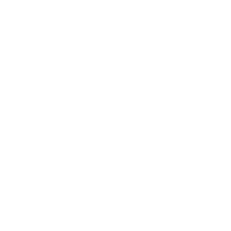
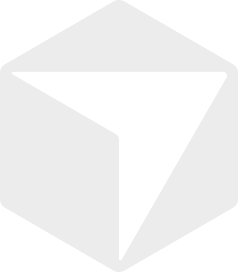

# **Hey, I'm Mariam !**

`Frontend Developer` &nbsp;·&nbsp; `Next.js` &nbsp;·&nbsp; `React`
 

<em>CS graduate with 1.5 years of hands-on experience across internships and freelance work. I build scalable, high-performance web applications with clean, responsive, pixel-perfect UIs.
</em>

> *I don't just ship features, I bring a distinct touch to every project.*

 

&nbsp;

 

## 🛠️ Tech Stack

### *Core*

  
  
  
  
  
  
  
  
  
  
  

 

### *Styling & UI*

  
  
  
  
  
  
  

 

### *Tools & Services*

  
  
  
  
  
  
  
  
  
  
  

 

### *Languages*

  
  
  
  
  

 

## 📊 GitHub Stats
 

<!--  -->

